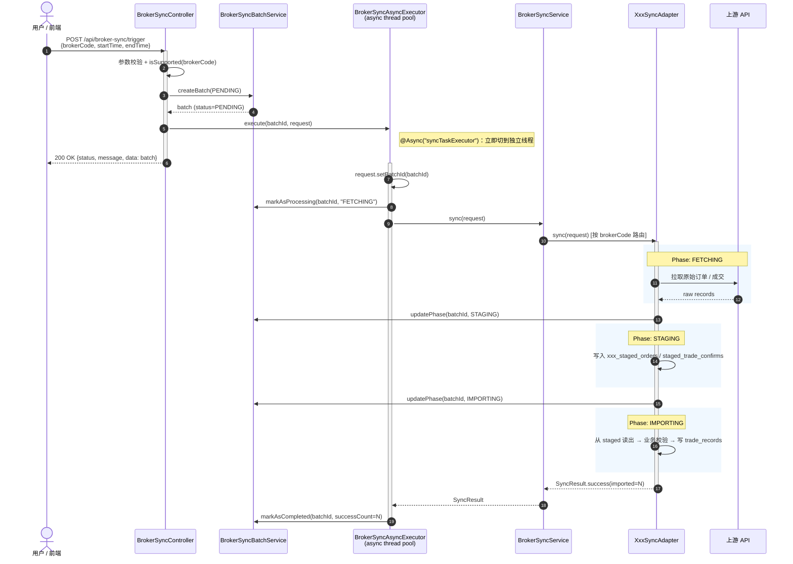

# 券商同步生命周期（框架层流程手册）

> **文档版本**：v1.0（2026-04-24）
> **读者**：**Adapter 作者** —— 当你准备新增一个券商适配器（`XxxSyncAdapter`），或者想搞清楚"一次同步请求从 HTTP 进来之后到底发生了什么"时，读这份。
>
> **这份文档不做什么**：不复述状态机细节（见 `import-consistency.md`）、不复述表结构（见 `data-persistence.md`）、不复述 adapter 注册发现机制（见 `broker-registration.md`）。它的作用是把这些纵向设计按**时间线串起来**，让 adapter 作者一眼看清自己负责的那一段在整条链路里的位置。

---

## 1. 文档定位与读者

### 1.1 和其他 framework 文档的分工

| 文档 | 视角 | 回答的问题 |
|------|------|-----------|
| [`data-persistence.md`](./data-persistence.md) | 数据模型 | batch / trade_records / staged 表长什么样、字段语义、两阶段原则 |
| [`import-consistency.md`](./import-consistency.md) | 状态与故障恢复 | batch 状态机、并发控制、fail-fast 清理、启动恢复、CLEANUP_FAILED SOP |
| [`broker-registration.md`](./broker-registration.md) | 扩展性 | 怎么把一个新 adapter 注册进框架、`brokerCode` 命名规则 |
| [`symbol-classification.md`](./symbol-classification.md) | 分类规则 | symbol / secType 怎么映射到 `AssetType` |
| [`unrecognized-data-logging.md`](./unrecognized-data-logging.md) | 日志规范 | 无法识别的数据怎么打日志、怎么触发 fail-fast |
| **本文 `sync-lifecycle.md`** | **时间线** | **一次同步从触发到落库（或失败清理）完整经过哪些组件、每个组件负责什么** |

### 1.2 触发方式

**当前版本所有同步均由 `POST /api/broker-sync/trigger` 手动触发**（前端 UI 或 API 调用）。**定时触发 / WebHook 是未来扩展点**，不在本文档范围内。无论将来如何扩展触发入口，§ 3 之后的异步链路都不会变。

---

## 2. 核心组件与职责

按调用顺序列出。每个组件一行职责概述 + 源码路径；详细实现看源码和对应的 framework 文档。

| # | 组件 | 职责 | 源码 |
|---|------|------|------|
| 1 | `BrokerSyncController` | HTTP 入口；参数校验；同步创建 PENDING batch；移交异步执行器后**立即返回** | `backend/.../controller/BrokerSyncController.java` |
| 2 | `BrokerSyncBatchService` | batch 状态转换的唯一入口（`markAsProcessing` / `updatePhase` / `markAsCompleted` / `markAsFailed` / `markAsCleanupFailed`） | `backend/.../service/BrokerSyncBatchService.java` |
| 3 | `BrokerSyncAsyncExecutor` | `@Async` 执行入口；把"同步工作"从 HTTP 线程切到同步线程池；统一 try/catch 收敛未捕获异常 | `backend/.../sync/core/BrokerSyncAsyncExecutor.java` |
| 4 | `BrokerSyncService` | adapter 注册表 + 分发器（`isSupported(brokerCode)` / `sync(request)` → 路由到具体 adapter） | `backend/.../sync/core/BrokerSyncService.java` |
| 5 | `BrokerSyncAdapter` | **券商专属实现**——你要写的那个类；负责"拉数据 → 写 staging → 从 staging 导入 trade_records" | `backend/.../sync/core/BrokerSyncAdapter.java`（接口） |
| 6 | `SyncBatchFailureHandler` | 统一的失败入口：`handleFailure(batchId, reason, phase)` → 触发清理 → 根据清理结果落 `FAILED` 或 `CLEANUP_FAILED` | `backend/.../sync/core/SyncBatchFailureHandler.java` |
| 7 | `SyncBatchCleanupService` | 编排清理事务：删 staged 行 + 删 trade_records；`@PostConstruct` 校验所有 adapter 都提供了清理策略 | `backend/.../sync/core/SyncBatchCleanupService.java` |
| 8 | `BrokerCleanupStrategy` | **每个 broker 必须提供一个**；只负责删该 broker 自己的 staged 表行 | `backend/.../sync/core/BrokerCleanupStrategy.java`（接口） |
| 9 | `SyncBatchRecoveryRunner` | 应用启动时扫非终态 batch，主动走 fail-fast（应对 JVM 崩溃 / kill -9） | `backend/.../sync/core/SyncBatchRecoveryRunner.java` |

> 作为 adapter 作者，你**必须**实现 #5 和 #8，其余组件都是框架提供的，不要改。

---

## 3. 一次成功同步的端到端时序

### 3.1 三个 phase

adapter 内部工作分三个 phase，由 `BrokerSyncBatchService.updatePhase()` 在 `broker_sync_batches.phase` 字段上显式推进：

| Phase | 含义 | 谁来切 |
|-------|------|-------|
| `FETCHING` | 正在调上游 API 拉原始数据 | Executor 在调用 adapter **之前**切入（`markAsProcessing` 一并设置） |
| `STAGING` | 已拉到数据，正在写 broker 专属 staged 表 | Adapter 在拉完 / 开始写 staged 时切入 |
| `IMPORTING` | staging 完成，正在把 staged 行搬到 `trade_records` | Adapter 在开始导入时切入 |

三个 phase 是递进式的：**一旦进入下一阶段就不再退回**。

### 3.2 时序图（成功路径）



### 3.3 同步返回 vs 异步继续的边界

**关键点**：`Controller` 只做三件事——**参数校验 / createBatch / 移交 async**——然后立即 200 返回。前端拿到 `batchId` 后通过 `GET /api/broker-sync/batches/{id}` 轮询进度。**所有实际 I/O 都在 async 线程上跑**。

`SyncRequest.batchId` 由 `BrokerSyncAsyncExecutor.execute(...)` 在调用 adapter 之前**单点注入**（调用 `request.setBatchId(batchId)`，紧挨在 `markAsProcessing` 之后），adapter 通过 `request.getBatchId()` 取。**不要自己 new 一个 batch**。

---

## 4. 失败路径与回滚

每种失败都有对应的处理，细节在 [`import-consistency.md`](./import-consistency.md) 中。本节只做**索引**。

| 失败发生点 | 表现 | 处理方式 | 对应章节 |
|-----------|------|---------|---------|
| **4.1 Controller 参数错** | `brokerCode` 缺失 / broker 不支持 | 直接 400，不建 batch | 代码自解释，不展开 |
| **4.2 409 并发冲突** | 已有 active batch（DB `uk_only_one_active` 触发） | Controller 捕获 `SyncConflictException` → 409 | `import-consistency.md § 4`（并发控制） |
| **4.3 `markAsProcessing` 阶段抛异常** | 极少见；batch 一直停在 PENDING | `SyncBatchRecoveryRunner` 启动时回收 | `import-consistency.md § 3.4`、§ 十 SOP |
| **4.4 Adapter 抛未捕获异常** | 任意 phase 下 throw | Executor 的 try/catch 兜底 → `SyncBatchFailureHandler.handleFailure` | `import-consistency.md § 5` |
| **4.5 Adapter 返回 `SyncResult.failure(...)`** | Adapter 自己判定失败（如单条 FAILED 触发批失败） | Executor 看到 success=false → 同 4.4 | `import-consistency.md § 5.6`（"单条失败整批失败"判定） |
| **4.6 清理本身失败**（删 staged / trade_records 出错） | `CLEANUP_FAILED`；`uk_only_one_active` 仍占据 | 需要人工介入 | `import-consistency.md § 十`（CLEANUP_FAILED SOP） |
| **4.7 JVM 崩溃 / kill -9 / OOM** | 非终态 batch 被遗留 | 启动时 `SyncBatchRecoveryRunner` 扫出来走 fail-fast | `import-consistency.md § 3.4` |

---

## 5. Adapter 作者实现指南

### 5.1 接口契约

```java
public interface BrokerSyncAdapter {
    String getBrokerCode();                  // 必须与 BrokerCleanupStrategy.brokerCode() 一致
    SyncResult sync(SyncRequest request);    // 同步主入口
}
```

**输入不变式**（框架保证）：
- `request.getBrokerCode()` == `getBrokerCode()`（框架已按 brokerCode 路由过来）
- `request.getBatchId()` != null（由框架注入；**不要自己建 batch**）
- 调用线程已是 async 线程池的线程，且 batch 状态已是 `PROCESSING` + phase=`FETCHING`

**输出不变式**（你要保证）：
- 方法返回前，`trade_records` 要么完整写入（成功），要么一条都没写（失败——失败场景交给框架清理，不要自己删）
- 成功返回 `SyncResult.success(importedCount)`；失败返回 `SyncResult.failure(reason)` **或**直接抛异常（两种都会被 framework 当作失败处理）
- **不要**自己 `markAsCompleted` / `markAsFailed`——那是 Executor 的职责

### 5.2 `batchId` 的正确使用

```java
@Override
public SyncResult sync(SyncRequest request) {
    Long batchId = request.getBatchId();    // 框架已注入
    // 写 staging 时把 batchId 写到每一行 staged 记录上
    stagedRow.setBatchId(batchId);
    // 写 trade_records 时同样写上（用于失败清理定位）
    tradeRecord.setBatchId(batchId);
    ...
}
```

**每一条 staged 行和每一条 trade_records 都必须带 `batchId`**，否则 `BrokerCleanupStrategy.deleteStagedRows(batchId)` 会删不干净、导致 `CLEANUP_FAILED`。

### 5.3 Phase 切换的时机

```java
batchService.updatePhase(batchId, "STAGING");   // 开始写 staged 之前
batchService.updatePhase(batchId, "IMPORTING"); // 开始写 trade_records 之前
```

> 当前签名是 `updatePhase(Long batchId, String phase)`——phase 为字符串字面量，合法值：`FETCHING` / `STAGING` / `IMPORTING`。参考 `IbkrSyncAdapter` / `TigerSyncAdapter` 的现有用法。

**粒度要求**：每个 phase 切换只调一次。不要在循环里反复切。

### 5.4 成功 / 失败返回值

| 情况 | 返回 |
|------|------|
| 全部导入成功 | `SyncResult.success(importedCount)` |
| 上游 API 无数据（empty range） | `SyncResult.success(0)` ← 这是**成功**，不是失败 |
| 上游报错（超时 / 401 / 5xx） | 抛异常 **或** `SyncResult.failure(reason)` |
| staging 阶段有单条行 FAILED | **必须**触发批失败（见 5.5） |
| IMPORTING 后 staged 有**非终态残留行**（`PENDING` / 其他非 `IMPORTED/SKIPPED/FAILED`） | **必须**触发批失败（见 5.5；这是 P0-2 修复引入的保护） |

### 5.5 两阶段导入的必守规则

**这是 framework 层最核心的契约，违反会导致数据不一致或永久脏数据**：

1. **幂等**：整个 `sync(...)` 方法必须可重跑。staged upsert 用业务键、trade_records 用业务键去重（具体见 `data-persistence.md § 两阶段原则`）。
2. **Fail-fast on FAILED or residual**：IMPORTING 结束后**必须**从 DB 重新统计 `failedCount` 和 `residualCount`（staged 表里状态 `NOT IN ('IMPORTED','SKIPPED','FAILED')` 的行数），只要 `failedCount > 0` 或 `residualCount > 0`，必须把整批判为失败（返回 `SyncResult.failure` 或抛异常），**不能跳过它继续**。`residualCount` 场景在 P0-2 修复前曾让 batch 静默变 COMPLETED——详见 [`fix-p0-data-loss-chain.md`](../fix-p0-data-loss-chain.md) 和 [`import-consistency.md § 5.6`](./import-consistency.md#56-单条失败整批失败-的具体判定)。参考实现：`TigerSyncAdapter` / `IbkrSyncAdapter` 里的 `if (failedCount > 0 || residualCount > 0)` 分支。
3. **不要在 adapter 内部吞异常**：失败 = 向外抛 / 返回 failure，让框架统一清理。
4. **不要在 rolled-back 事务内做 save**：这是 v2.4.3 修过的 P0 bug（见 `import-consistency.md § 十四`）。如果你的 staging 写入出错，让事务整体回滚，FAILED 标记改到**新事务**里做。

### 5.6 必须配套提供 `BrokerCleanupStrategy`

```java
@Component
public class XxxCleanupStrategy implements BrokerCleanupStrategy {
    @Override public String brokerCode() { return "xxx"; }

    @Override public void deleteStagedRows(Long batchId) {
        // 删你所有 xxx_staged_* 表里 batch_id = ? 的行
        // 不要开新事务（由调用方 SyncBatchCleanupService 的 @Transactional 包着）
        // 不要删 trade_records ——那是框架 SyncBatchCleanupService 的职责，
        // 框架会在调用本方法后统一按 batch_id 清 trade_records
    }
}
```

**忘了提供会怎样**：`SyncBatchCleanupService` 在 `@PostConstruct` 会做覆盖检查，任何 adapter 没有匹配的 cleanup strategy 都会导致**应用启动失败**——这是有意为之的保护。

---

## 6. 并发与幂等

### 6.1 单 active batch 约束

**同一时刻系统内只允许有一个非终态的 batch**（全 broker 共享此约束）。由 DB 部分唯一索引 `uk_only_one_active` 强制。并发触发时后到的那个请求会在 Controller 阶段 409。细节：[`import-consistency.md § 4`](./import-consistency.md#四并发控制db-级唯一约束)。

### 6.2 重跑安全

两层幂等：
- **Staging**：业务键 upsert（Tiger 用 `tiger_id` = `TradeOrder.getId()` 全局订单 ID；IBKR 用 `order_id`）
- **Import**：`trade_records` 有业务键唯一约束，同一笔重复写会被 DB 挡掉

这样即使上层因任何原因触发了同一批次的重试（实际目前框架并不自动重试成功路径——此处只是**防御性**地确保"假如发生"也不会脏数据）。

### 6.3 Cursor / date range 推进（当前策略）

- `SyncRequest.startTime / endTime` 由**调用方**（前端 UI 表单或 API caller）指定
- adapter **不**维护 "上次同步到哪" 的 cursor
- adapter 必须在给定 range 内**完成全部翻页**，不向外暴露分页游标
- **Roadmap**：未来若需要真正的增量同步，会在 `broker_sync_batches` 表加 `watermark` 字段；当前不做

---

## 7. 可观测性

### 7.1 必打的日志锚点

每个 adapter **至少**打以下几条 INFO（用于日志回放诊断生命周期卡在哪一步）。所有生命周期相关的 INFO / WARN / ERROR 都**必须带 `batchId`**，以便在多 batch 混合的日志里按 id 回放。

| 时机 | 示例日志 |
|------|---------|
| `sync()` 入口 | `"[xxx-sync] batch={} start, range={}..{}"` |
| Phase 切换前 | `"[xxx-sync] batch={} -> STAGING, fetched={} rows"` |
| Phase 切换前 | `"[xxx-sync] batch={} -> IMPORTING, staged={} rows"` |
| `sync()` 正常返回前 | `"[xxx-sync] batch={} done, imported={}"` |
| 失败前（return failure / throw 之前） | `log.error("[xxx-sync] batch={} failed: {}", batchId, reason)` |

> **已上线 adapter 现状对齐备注**（2026-04-24）：`TigerSyncAdapter` / `IbkrSyncAdapter` 的日志锚点**目前部分不符合本规范**——入口 / phase 切换 / 完成这几条 INFO 要么没带 `batchId`、要么直接缺失（batch 完成日志实际由 `BrokerSyncAsyncExecutor` 统一打，不是 adapter 自己）。本规范为**目标形态**，新增 adapter 必须遵守；Tiger/IBKR 的对齐工作作为独立 tech-debt 跟踪。
>
> 同样地，[`unrecognized-data-logging.md`](./unrecognized-data-logging.md) 要求的 `[AUTH]` / `[NETWORK]` / `[UNRECOGNIZED]` / `[INTERNAL]` 失败分类前缀，以及 [`symbol-classification.md`](./symbol-classification.md) 要求的 `<Broker>SyncException(FailureCategory.UNRECOGNIZED, externalId, ...)` 异常类型，**Tiger/IBKR 目前均未实现**（它们走的是 `IllegalArgumentException` + staged 单行 FAILED + 汇总层 fail-fast 的旧路径——最终行为等价，但缺规范化的分类与 external_id 追溯信息）。

### 7.2 分级约定

- `info` — 正常生命周期节点
- `warn` — 已自我恢复的异常（比如某条上游数据缺字段但**按业务规则可跳过**）。**注意**：能跳过的都要走 `UNRECOGNIZED` 明确分类，不要静默跳过。见 [`unrecognized-data-logging.md`](./unrecognized-data-logging.md)
- `error` — 将导致整批失败的异常；必须带 `batchId`

### 7.3 日志消息语言

**全部英文**。这是项目硬规则。

---

## 8. 交叉引用与扩展点

- 想加一个新 broker？先读 [`broker-registration.md`](./broker-registration.md)，再回来读本文的 § 5。
- 想扩展某 adapter 的 `AssetType` 支持范围？见 [`symbol-classification.md § 7`](./symbol-classification.md)。
- 想搞懂一次失败是怎么被清理的？读 [`import-consistency.md § 5`](./import-consistency.md#五清理机制)。
- 想知道 batch 表字段每一列什么意思？查 [`data-persistence.md`](./data-persistence.md)。
- 遇到 `CLEANUP_FAILED`？按 [`import-consistency.md § 十`](./import-consistency.md#十cleanup_failed-的人工处理-sop) 的 SOP 处理。
- 无法识别的 symbol / secType 怎么打日志？[`unrecognized-data-logging.md`](./unrecognized-data-logging.md)。

---

**维护者备忘**：本文档一旦与代码不符——哪怕只是 phase 切换时机变了——都应立即更新。这是项目的「文档同步零债务」红线。
