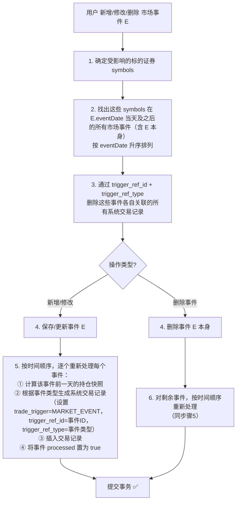
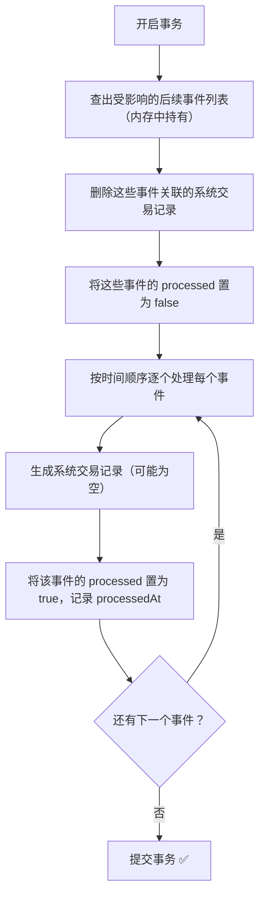

# 市场事件处理方案设计文档

> 创建日期：2026-03-08
> 状态：方案已确认，待实现

---

## 一、背景

当前 `PositionService` 已实现了基于交易记录的基础持仓计算，支持：

- 按 `(symbol, brokerId)` 维度聚合
- 处理 `BUY` / `SELL` / `OPTION_EXPIRE` / `EXERCISE_BUY` / `EXERCISE_SELL` 五种交易类型
- 行权交易对正股的影响

**缺少的部分**：未考虑三类市场事件对持仓的影响。

---

## 二、三类市场事件

系统中已有三类市场事件的数据模型（均继承自 `BaseMarketEvent`）：

| 事件类型 | 实体类 | 数据库表 | 关键字段 | 持仓影响 |
|---------|--------|---------|---------|---------|
| **拆股** | `StockSplitEvent` | `events_stock_split` | `symbol`, `eventDate`, `ratioFrom`, `ratioTo` | 持仓数量按 `ratioTo/ratioFrom` 调整。如 TSLA 1拆3，100股→300股 |
| **代码变更** | `SymbolChangeEvent` | `events_symbol_change` | `symbol`, `eventDate`, `oldSymbol`, `newSymbol` | oldSymbol 的全部持仓转移到 newSymbol。如 FB→META |
| **实物分红** | `DividendInKindEvent` | `events_dividend_in_kind` | `symbol`, `eventDate`, `dividendSymbol`, `dividendQtyPerShare`, `fairValuePerShare` | 根据持仓数量新增 dividendSymbol 的持仓。如持有1000股A，每股分红0.5股B，公允价格$150 → 新增500股B，持仓成本 = 500 × $150 = $75,000 |

`BaseMarketEvent` 公共字段：
- `symbol` - 涉及的证券代码
- `symbolName` - 证券名称
- `currency` - 所属市场币种
- `eventDate` - 事件生效日期
- `description` - 事件描述/备注
- `isDeleted` - 软删除标记

---

## 三、设计方案与关键决策

### 最终方案：市场事件转交易记录

**结论**：当用户录入市场事件时，系统计算事件发生前一天的持仓，据此生成系统交易记录插入 `trade_records` 表。这些记录标记为 `MARKET_EVENT` 类型，与用户手动录入的交易记录共存。

**为什么选择这个方案**：

| 对比维度 | ❌ 否决方案（时间线混合计算） | ✅ 采纳方案（事件转交易记录） |
|---------|--------------------------|---------------------------|
| 核心思路 | 每次查持仓时将交易记录与市场事件混合排序遍历 | 事件写入时一次性生成交易记录，后续查持仓无额外开销 |
| 持仓计算复杂度 | 高（多类型分支、混合排序） | 低（只处理交易记录，逻辑统一） |
| 对现有代码影响 | 需大幅重构 `PositionService` | `PositionService` 完全不用改，复用 BUY/SELL 逻辑 |
| 可审计性 | 差（事件影响是隐式计算结果） | 好（用户能看到系统生成的交易记录，清楚持仓变化原因） |

**隐患与应对**：

| 隐患 | 说明 | 应对措施 |
|------|------|----------|
| 补录历史事件导致后续事件不一致 | 插入早期事件后，晚期事件的基础持仓已变化，原有系统交易记录不再正确 | 级联重算机制（详见 4.2） |
| 事务中途失败导致数据不一致 | 删除旧记录后若重新生成失败，交易数据残缺 | 整个流程包裹在数据库事务中（详见 4.3） |
| "处理过但无影响" vs "未处理" 难以区分 | 某些事件执行后不产生交易记录（如事件发生时无持仓） | 增加 `processed` 状态字段（详见 4.4） |

---

## 四、最终方案详细设计

### 4.1 核心流程



### 4.2 级联重算机制

**关键边界场景**：当用户补录一个历史市场事件时，该事件发生之后可能已有针对同一标的证券的其他事件。

**示例**：
- 2020-08-31 AAPL 拆股 1:4（已录入，已生成系统交易记录）
- 2023-06-15 AAPL 拆股 1:2（用户现在补录）

如果 2020年的拆股是后补录的，而2023年的拆股已经基于「未拆股」的持仓计算了，则2023年的系统交易记录数量就不正确。

**解决方案**：插入或修改一个历史事件时，必须通过 `trigger_ref_id` + `trigger_ref_type` 找到并删除针对同一标的证券后续所有事件产生的系统交易记录，然后重新根据事件的先后顺序执行一遍。

### 4.3 事务处理

整个「删除旧交易记录 → 重新生成新交易记录」的过程放在一个数据库事务里，要么全部成功，要么全部回滚。

**安全措施**：
1. **事务保护**：防止处理一半程序挂了，数据一致性得不到保证
2. **先查后删**：在事务开始时，先把需要重新执行的事件列表查出来 hold 在内存中，后续操作都基于这个内存列表，不再依赖中间状态的数据库查询

### 4.4 事件处理状态字段

在市场事件表中增加 `processed` 字段标记已经执行过的事件。

**字段设计**：

| 字段 | 类型 | 说明 |
|------|------|------|
| `processed` | Boolean | 是否已处理（默认 false） |
| `processedAt` | DateTime | 处理时间（可选，便于追溯） |

**语义说明**：使用 `processed`（已处理）而非 `executed`（已执行），因为：
- 有些事件执行后可能**不产生交易记录**（比如拆股事件发生时，用户在该券商根本没有持仓）
- 没有这个字段，就无法区分「这个事件处理过了，只是没有影响」和「这个事件还没被处理」

**在级联重算流程中的使用**：



先置 `false`，再逐个处理后置 `true`，即使事务中途失败回滚，所有状态都会恢复一致。

---

## 五、各事件类型生成的系统交易记录

**关键决策：市场事件不新增 TradeType，统一复用 `BUY` / `SELL`。** 区分来源通过 `trade_trigger = MARKET_EVENT` + `trigger_ref_type` 实现，详见 [trade-trigger-design.md](trade-trigger-design.md)。

| 市场事件 | 生成的交易记录 | TradeType | 示例 |
|---------|-------------|-----------|------|
| **拆股 1:3** | 对持有该 symbol 的每个券商，生成一条 BUY 记录，数量 = 原持仓 × (ratioTo/ratioFrom - 1) | `BUY` | 持有100股，拆股1:3 → 生成 BUY 200股（价格=0，金额=0） |
| **代码变更** | 对持有 oldSymbol 的每个券商，生成两条记录：① SELL oldSymbol 全部持仓 ② BUY newSymbol 同等数量 | `SELL` + `BUY` | FB 100股（平均成本$300） → SELL FB 100（价格=$300，金额=$30000） + BUY META 100（价格=$300，金额=$30000），费用=0 |
| **实物分红** | 对持有该 symbol 的每个券商，生成一条 dividendSymbol 的 BUY 记录，数量 = 持仓 × dividendQtyPerShare | `BUY` | 持有1000股A，每股分红0.5股B，公允价格$150 → BUY B 500股（价格=$150，金额=$75,000） |

> 拆股生成的交易记录，价格、费用、金额均为 **0**，不影响收益统计。
> 代码变更生成的交易记录，价格和金额继承原持仓的平均成本，确保成本从旧代码平滑转移到新代码，费用为 **0**。
> 实物分红生成的交易记录，价格采用公司公告中的**公允价格**（`fairValuePerShare`），金额 = 公允价格 × 分红数量，费用为 **0**。公允价格用于建立新持仓的成本基础，确保后续卖出时收益计算正确。

### 5.1 拆股事件详细逻辑

```
输入：StockSplitEvent (symbol, eventDate, ratioFrom, ratioTo)

1. 计算 eventDate 前一天的持仓快照
2. 从持仓快照中筛选出持有该 symbol 的所有 (brokerId, quantity) 记录
3. 对每个持仓记录：
   - 新数量 = quantity × ratioTo / ratioFrom
   - 增量 = 新数量 - quantity  (即 quantity × (ratioTo/ratioFrom - 1))
   - 生成一条系统交易记录：
     * tradeDate = eventDate
     * symbol = event.symbol
     * tradeType = BUY
     * quantity = 增量（取整，使用 Math.round()）
     * price = 0, amount = 0, fee = 0
     * brokerId = 持仓的 brokerId
     * trade_trigger = MARKET_EVENT
     * trigger_ref_id = event.id
     * trigger_ref_type = STOCK_SPLIT
```

**碎股处理**：拆股后可能出现小数（如持有1股时1拆3），使用 `Math.round()` 取整。

### 5.2 代码变更详细逻辑

```
输入：SymbolChangeEvent (symbol, eventDate, oldSymbol, newSymbol)

1. 计算 eventDate 前一天的持仓快照
2. 从持仓快照中筛选出持有 oldSymbol 的所有 (brokerId, quantity) 记录
3. 对每个持仓记录：
   - 计算该券商下 oldSymbol 的平均持仓成本 avgCost = 总成本 / 持仓数量
   - 总成本 totalCost = avgCost × 持仓数量
   - 生成两条系统交易记录：
   a) SELL oldSymbol：
     * tradeDate = eventDate
     * symbol = oldSymbol
     * tradeType = SELL
     * quantity = 原持仓数量
     * price = avgCost, amount = totalCost, fee = 0
   b) BUY newSymbol：
     * tradeDate = eventDate
     * symbol = newSymbol
     * tradeType = BUY
     * quantity = 原持仓数量
     * price = avgCost, amount = totalCost, fee = 0
   * 两条记录均设置：
     * trade_trigger = MARKET_EVENT
     * trigger_ref_id = event.id
     * trigger_ref_type = SYMBOL_CHANGE
```

### 5.3 实物分红详细逻辑

```
输入：DividendInKindEvent (symbol, eventDate, dividendSymbol, dividendQtyPerShare, fairValuePerShare)

1. 计算 eventDate 前一天的持仓快照
2. 从持仓快照中筛选出持有该 symbol 且 quantity > 0 的所有记录
3. 对每个持仓记录：
   - 分红数量 = (int)(quantity × dividendQtyPerShare)（向下取整，与券商碎股处理一致）
   - 分红金额 = fairValuePerShare × 分红数量
   - 生成一条系统交易记录：
     * tradeDate = eventDate
     * symbol = dividendSymbol
     * tradeType = BUY
     * quantity = 分红数量
     * price = fairValuePerShare, amount = 分红金额, fee = 0
     * brokerId = 持仓的 brokerId
     * trade_trigger = MARKET_EVENT
     * trigger_ref_id = event.id
     * trigger_ref_type = DIVIDEND_IN_KIND
```

---

## 六、数据模型变更

### 6.1 TradeType 枚举：无需修改

**市场事件不新增 TradeType 枚举值**，统一复用现有的 `BUY` / `SELL`。

理由：
- TradeType 描述的是「做了什么动作」，拆股/代码变更/实物分红的实际效果就是买入和卖出
- 复用 `BUY`/`SELL` 后，`PositionService.calculateQuantityDelta()` 无需修改
- 「为什么发生」由 `trade_trigger` + `trigger_ref_type` 表达，职责分离更清晰

现有枚举保持不变：
```java
public enum TradeType {
    BUY,            // 买入
    SELL,           // 卖出
    OPTION_EXPIRE,  // 期权到期
    EXERCISE_BUY,   // 行权买股
    EXERCISE_SELL   // 行权卖股
}
```

### 6.2 TradeRecord 表扩展

在 `trade_records` 表中新增交易触发来源相关字段，详见 [trade-trigger-design.md](trade-trigger-design.md)：

| 字段 | 类型 | 约束 | 说明 |
|------|------|------|------|
| `trade_trigger` | VARCHAR(32) | `NOT NULL`，无默认值 | 交易触发来源：`MANUAL` / `OPTION_EXERCISE` / `MARKET_EVENT` |
| `trigger_ref_id` | BIGINT | `NOT NULL DEFAULT 0` | 触发来源的关联记录 ID，`0` 表示无关联 |
| `trigger_ref_type` | VARCHAR(32) | 可空 | 触发来源的关联记录类型，区分 `trigger_ref_id` 指向哪张表 |

市场事件场景下的用法：
- `trade_trigger` = `MARKET_EVENT`
- `trigger_ref_id` = 对应市场事件记录的 ID
- `trigger_ref_type` = `STOCK_SPLIT` / `SYMBOL_CHANGE` / `DIVIDEND_IN_KIND`

这三个字段的用途：
1. **反向追溯**：从交易记录可以查到是哪个市场事件生成的
2. **清理机制**：修改/删除市场事件时，通过 `trigger_ref_id` + `trigger_ref_type` 找到并删除关联的系统交易记录
3. **来源分类**：通过 `trade_trigger` 可以快速区分手动交易、期权行权和市场事件生成的交易

### 6.3 BaseMarketEvent 表扩展

在三个市场事件表中新增：

| 字段 | 类型 | 说明 |
|------|------|------|
| `processed` | Boolean | 是否已处理（默认 false） |
| `processed_at` | DateTime (nullable) | 处理时间 |

---

## 七、受影响的 symbols 确定规则

不同事件类型确定受影响 symbols 的规则：

| 事件类型 | 受影响的 symbols |
|---------|----------------|
| **拆股** | 拆股的 symbol |
| **代码变更** | `oldSymbol` 和 `newSymbol`（后续事件中引用这两个 symbol 的都要重算） |
| **实物分红** | 原始 symbol 和 `dividendSymbol` |

---

## 八、PositionService 的影响

由于市场事件统一复用 `BUY` / `SELL` 作为 TradeType，`PositionService` **完全不需要修改**。

- `calculateQuantityDelta()` 方法现有的 `BUY`（+quantity）和 `SELL`（-quantity）逻辑天然适用
- 拆股生成的 BUY 记录，quantity 为增量，直接加到持仓上
- 代码变更生成的 SELL 旧代码 + BUY 新代码，持仓自动正确更新
- 实物分红生成的 BUY 记录，quantity 为分红获得的股数，直接加到持仓上

这是选择「复用 BUY/SELL」而非「新增 TradeType」的核心优势。

---

## 九、前端影响

**前端无需修改持仓快照功能**。市场事件的处理完全在后端完成，`GET /api/positions` 的接口入参和出参保持不变。

在交易记录列表中，系统生成的记录通过 `trade_trigger = MARKET_EVENT` 识别（而非 TradeType），前端可据此添加「系统生成」标签，方便用户区分手动交易和系统交易。

---

## 十、边界情况与防护

| 场景 | 处理策略 |
|------|---------|
| 同一 symbol 多次拆股 | 级联重算机制保证按时间顺序依次处理，每次基于前一天的正确持仓 |
| 代码变更链（A→B→C） | 依次处理，A→B 后 A 的持仓归入 B，后续 B→C 时 B（含原 A）都归入 C |
| 拆股+代码变更同一天 | 按事件 ID 或时间戳排序确定先后顺序 |
| 分红数量为小数 | 向下取整（`Math.floor`），与券商碎股处理行为一致 |
| 拆股导致的碎股 | 使用 `Math.round()` 取整 |
| 没有录入市场事件 | 回退到现有行为，不影响基础交易持仓计算 |
| 事件处理时无持仓 | `processed` 标记为 true，但不生成系统交易记录（"处理过了，但无影响"） |
| 事务中途失败 | 整个操作回滚，`processed` 状态恢复一致 |
| 删除市场事件后有后续事件 | 删除后仍需级联重算后续事件（基础持仓变了） |

---

## 十一、关键设计决策总结

| 决策 | 原因 |
|------|------|
| 采纳「事件转交易记录」，否决「时间线混合计算」 | 关注点分离，查持仓零额外开销，不重构 PositionService |
| 级联重算机制 | 补录历史事件时后续事件基础持仓会变，必须重算 |
| 数据库事务保护 | 防止中途失败导致数据不一致 |
| 增加 `processed` 字段（而非 `executed`） | 区分「未处理」和「处理后无影响」，语义更准确 |
