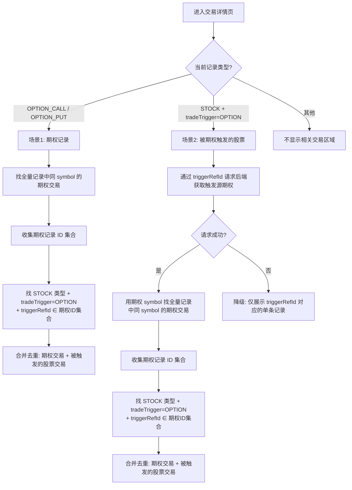

# 交易记录详情 —— 相关交易展示规则设计

> 创建日期：2026-03-12
> 状态：已实现
> 实现文件：`frontend/src/pages/trade/TradeRecordDetail.jsx`

---

## 一、背景

在交易记录详情页面底部，有一个「相关交易」区域，用于展示与当前记录存在业务关联的其他交易记录。这个功能的核心目的是：

1. **期权交易溯源**：查看同一期权合约的全部交易历史（买入、卖出、到期、行权等）
2. **联动关系可视化**：将期权与其触发的股票交易关联展示，便于理解因果关系
3. **快速导航**：点击关联记录的 ID 可跳转到对应详情页进行查看或修改

由于期权交易涉及多条记录间的复杂关联（期权本身的多笔交易 + 期权触发的股票交易），关联规则需要明确设计。

---

## 二、前置概念

### 2.1 数据模型中的关键字段

| 字段 | 说明 | 相关文档 |
|------|------|---------|
| `assetType` | 证券类型：`STOCK`（股票）、`OPTION_CALL`（看涨期权）、`OPTION_PUT`（看跌期权） | — |
| `symbol` | 证券代码，期权合约的唯一标识（如 `TSLA 240119C210`） | — |
| `tradeTrigger` | 交易触发来源：`MANUAL`（手动）、`OPTION`（期权事件）、`MARKET_EVENT`（市场事件） | [trade-trigger-design.md](trade-trigger-design.md) |
| `triggerRefId` | 触发来源的关联记录 ID，`0` 表示无关联 | [trade-trigger-design.md](trade-trigger-design.md) |
| `triggerRefType` | 触发来源的关联记录类型：`OPTION_EXPIRE`、`OPTION_EXERCISE`、`OPTION_ASSIGNED` 等 | [trade-trigger-design.md](trade-trigger-design.md) |

### 2.2 期权与股票的关联模式

根据 [trade-trigger-design.md](trade-trigger-design.md) 中的设计：

- **期权侧记录**（触发源头）：`tradeTrigger = OPTION`，`triggerRefId = 0`
- **股票侧记录**（被触发方）：`tradeTrigger = OPTION`，`triggerRefId = 期权侧交易记录ID`

关联方向为**单向**：股票侧通过 `triggerRefId` 指向期权侧，期权侧不存储反向引用。

---

## 三、关联规则

### 3.1 触发条件

「相关交易」区域**仅在以下两种场景**下展示，其他类型的交易记录不展示此区域：

| 场景 | 当前记录条件 | 说明 |
|------|-------------|------|
| 场景1 | `assetType` 为 `OPTION_CALL` 或 `OPTION_PUT` | 当前记录是期权交易 |
| 场景2 | `assetType` 为 `STOCK` 且 `tradeTrigger` 为 `OPTION` 且 `triggerRefId ≠ 0` | 当前记录是被期权触发的股票交易 |

### 3.2 场景1：当前记录是期权交易

**目标**：展示该期权合约的完整交易链，包括所有同合约的期权交易和由这些期权触发的股票交易。

**计算步骤**：

```
步骤1：在全量交易记录中，筛选出 symbol 与当前期权记录的 symbol 完全相同的所有记录
       → 得到「同合约期权记录集合」

步骤2：收集步骤1中所有期权记录的 id，组成 ID 集合

步骤3：在全量交易记录中，筛选出同时满足以下条件的记录：
       - assetType === 'STOCK'
       - tradeTrigger === 'OPTION'
       - triggerRefId 存在于步骤2的 ID 集合中
       → 得到「被触发的股票记录集合」

步骤4：将步骤1和步骤3的结果合并去重 → 最终展示列表
```

**示例**：

假设当前查看的是 ID=10 的期权记录，symbol 为 `TSLA 240119C210`：

| ID | assetType | symbol | tradeTrigger | triggerRefId | 是否展示 | 原因 |
|----|-----------|--------|-------------|--------------|---------|------|
| 10 | OPTION_CALL | TSLA 240119C210 | MANUAL | 0 | ✅ | 同 symbol 期权（当前记录） |
| 11 | OPTION_CALL | TSLA 240119C210 | MANUAL | 0 | ✅ | 同 symbol 期权 |
| 12 | OPTION_CALL | TSLA 240119C210 | OPTION | 0 | ✅ | 同 symbol 期权（到期/行权的期权侧） |
| 20 | STOCK | TSLA | OPTION | 12 | ✅ | triggerRefId=12，指向同 symbol 期权 |
| 21 | STOCK | TSLA | OPTION | 99 | ❌ | triggerRefId=99，不在同 symbol 期权 ID 集合中 |
| 30 | OPTION_CALL | AAPL 240119C180 | MANUAL | 0 | ❌ | symbol 不同 |
| 40 | STOCK | TSLA | MANUAL | 0 | ❌ | tradeTrigger 不是 OPTION |

### 3.3 场景2：当前记录是被期权触发的股票交易

**目标**：反向追溯到触发源期权的合约，展示该合约的完整交易链（与场景1相同的展示范围）。

**计算步骤**：

```
步骤1：通过当前记录的 triggerRefId，向后端 API 请求获取触发源期权交易记录
       → 得到「触发源期权记录」及其 symbol

步骤2：在全量交易记录中，筛选出 symbol 与触发源期权的 symbol 完全相同的所有记录
       → 得到「同合约期权记录集合」

步骤3：收集步骤2中所有期权记录的 id，组成 ID 集合

步骤4：在全量交易记录中，筛选出同时满足以下条件的记录：
       - assetType === 'STOCK'
       - tradeTrigger === 'OPTION'
       - triggerRefId 存在于步骤3的 ID 集合中
       → 得到「被触发的股票记录集合」

步骤5：将步骤2和步骤4的结果合并去重 → 最终展示列表
```

**降级策略**：如果步骤1的后端请求失败（网络异常、记录已删除等），降级为仅展示 `triggerRefId` 对应的单条记录。

**示例**：

假设当前查看的是 ID=20 的股票记录，`tradeTrigger=OPTION`，`triggerRefId=12`：

```
步骤1：请求后端获取 ID=12 的记录 → symbol 为 TSLA 240119C210
步骤2：筛选全量记录中 symbol = TSLA 240119C210 的记录 → [ID=10, 11, 12]
步骤3：ID 集合 = {10, 11, 12}
步骤4：筛选 STOCK + OPTION + triggerRefId ∈ {10, 11, 12} → [ID=20]
步骤5：合并 → [ID=10, 11, 12, 20]（当前记录 ID=20 也在其中）
```

### 3.4 整体流程图



---

## 四、两个场景的关系

两个场景最终展示的关联记录范围是**完全对等**的——无论从期权记录出发还是从被触发的股票记录出发，都能看到完整的同一交易链：

```
┌──────────────────────────────────────────────────────────┐
│                    完整交易链                              │
│                                                          │
│  ┌─────────────────────────────────────┐                 │
│  │    同 symbol 的所有期权交易记录         │                 │
│  │  (买入、卖出、到期、行权、被指派...)     │                 │
│  └──────────────────┬──────────────────┘                 │
│                     │ triggerRefId 指向                    │
│                     ▼                                     │
│  ┌─────────────────────────────────────┐                 │
│  │  被这些期权触发的股票交易记录            │                 │
│  │  (行权买股、行权卖股、被指派买/卖...)    │                 │
│  └─────────────────────────────────────┘                 │
│                                                          │
│  场景1：从期权记录进入 → 看到整个框                         │
│  场景2：从股票记录进入 → 反向追溯，同样看到整个框              │
└──────────────────────────────────────────────────────────┘
```

---

## 五、展示细节

### 5.1 区域标题

| 场景 | 标题描述文案 |
|------|------------|
| 场景1（期权记录） | `期权合约 {symbol} 的全部交易及触发的股票交易` |
| 场景2（股票记录） | `触发本交易的期权合约及相关全部交易记录` |

### 5.2 当前记录高亮

关联交易列表中会包含当前正在查看的记录本身。为便于识别，当前记录所在行会有特殊高亮样式：

- 行背景色为浅蓝色（`#e6f4ff`）
- 行左侧有 3px 宽的蓝色竖线标识（`#1677ff`）

### 5.3 列定义

关联交易表格复用主列表的列定义（`TradeColumns`），包括 ID（可点击跳转详情）、交易日期、券商、证券类型、证券代码、交易类型、数量、价格、金额等。

### 5.4 分页

- 关联记录 ≤ 10 条时不分页
- 关联记录 > 10 条时按每页 10 条分页

---

## 六、实现要点

### 6.1 辅助函数抽取

由于两个场景都需要执行"根据期权 ID 集合查找被触发的股票交易"这一操作，将其抽取为独立的辅助函数 `findTriggeredStockRecords`：

```javascript
const findTriggeredStockRecords = (optionIds, allRecords) => {
  return allRecords.filter(
    (r) => r.assetType === 'STOCK' 
        && r.tradeTrigger === 'OPTION' 
        && optionIds.has(r.triggerRefId)
  );
};
```

### 6.2 合并去重策略

两个集合（同 symbol 期权记录 + 被触发的股票记录）可能存在 ID 重复（虽然概率极低），通过 `Map` 以 `id` 为 key 进行去重：

```javascript
const mergedMap = new Map();
[...sameSymbolRecords, ...triggeredStocks].forEach((r) => mergedMap.set(r.id, r));
return Array.from(mergedMap.values());
```

### 6.3 数据来源

- **全量交易记录**：页面加载时通过 `fetchAllTradeRecords()` 一次性获取，避免多次请求
- **触发源期权记录**（场景2）：通过 `fetchTradeRecordById(triggerRefId)` 单独请求，因为全量数据中可能不包含该记录的详细信息（如已软删除的情况）

---

## 七、局限与后续优化

| # | 局限 | 说明 | 可能的优化方向 |
|---|------|------|--------------|
| 1 | 依赖全量数据前端过滤 | 当前实现在前端对全量交易记录进行内存过滤，数据量大时可能存在性能瓶颈 | 后端提供专用的关联交易查询 API |
| 2 | 场景2需要额外 API 请求 | 股票记录需要通过 `triggerRefId` 额外请求一次后端获取期权 symbol | 在全量数据中直接通过 `triggerRefId` 查找（如果全量数据完整） |
| 3 | 仅覆盖期权关联场景 | 当前仅处理期权交易和被期权触发的股票交易，未覆盖市场事件（拆股、代码变更等）关联 | 未来可扩展支持 `tradeTrigger = MARKET_EVENT` 的关联展示 |
| 4 | symbol 匹配为精确匹配 | 同一底层资产的不同期权合约（不同行权价/到期日）不会关联 | 如需按底层资产聚合，可改用 `underlyingSymbol` 进行匹配 |
